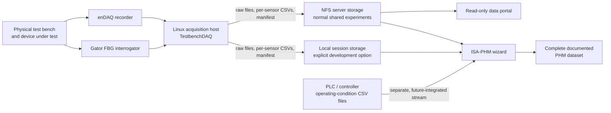

# TestbenchDAQ

TestbenchDAQ acquires external-sensor measurements from a test bench. It
coordinates a PhotonFirst Gator FBG interrogator and an enDAQ recorder from
one command-line application on the Linux acquisition host.

It supports two kinds of data-collection experiments for predictive-maintenance
research:

- **Diagnostic tests** capture a system's response to a controlled fault.
- **Prognostic tests** collect repeated measurements in a run-to-failure
  experiment as degradation develops.

TestbenchDAQ acquires and preserves the measurement files; it does **not**
create an ISA-PHM dataset. Its per-sensor time/value CSV files and session
manifest prepare the acquisition output for later bundling in the ISA-PHM
wizard with test-bench operating-condition data and experiment metadata.

## How it fits together



Recordings can be stored locally or on an external NTFS server. Storing them
on the server prevents the acquisition computer's internal disk from filling
up. The server portal lets you remotely view and download recordings.

## Start here

The supported production path is **Linux on AArch64** with Python 3.11 or
newer. Gator acquisition requires a separately distributed PhotonFirst runtime;
the installer retrieves the approved version for authorized users.

```bash
git clone https://github.com/NathanHouwaart/TestbenchDAQ.git
cd TestbenchDAQ
./scripts/install/setup_linux.sh
```

The guided setup installs the Python application, asks whether to install
Gator and/or enDAQ support, and verifies `tbdaq --help`. For unattended setup,
use `--gator`, `--endaq`, or `--all`; see the
[getting-started guide](docs/getting-started.md) for prerequisites, first runs,
and troubleshooting.

Windows has an **experimental**, Gator-only native helper for local hardware
validation. It is not a supported production-acquisition or enDAQ workflow;
see [the Windows helper guide](gator_recorder/windows/README.md).

## Documentation

- [Getting started](docs/getting-started.md) — install, configure, verify, and
  take a first local measurement.
- [Command cookbook](docs/command-cookbook.md) — copyable local and NFS-backed
  diagnostic and prognostic commands.
- [Command reference (man page)](docs/tbdaq-manual.md) — every `tbdaq` action
  and option.
- [Central storage and data portal](docs/data-portal.md) — configure normal
  NFS-backed storage and the read-only server portal.
- [Design contract](docs/design.md) — lifecycle, safety, scheduling, and
  timing behavior.

## Development

The orchestration tests use simulated adapters and do not command hardware:

```bash
python -m unittest discover -s tests -v
python -m compileall -q tbdaq tests
```
